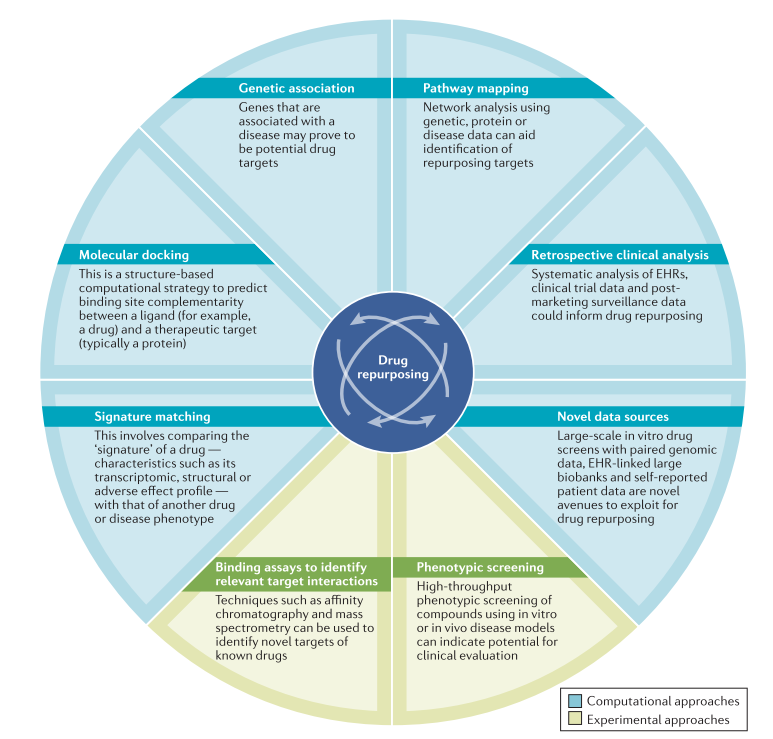

# Topic 05 : Drug viability screens for oncological and non-oncological treatments

Supervisors: 

* Carl Herrmann (carl.herrmann@uni-heidelberg.de)
* Ana L. Costa (luisa.costa@bioquant.uni-heidelberg.de)


## Introduction

Drug repurposing, i.e. the application of a compound to a different disease type, is an attractive strategy, compared with the development of a new drug. Hence, screening efforts are underway to re-analyse the efficacy of already approved drugs in a different setting. Treatments for rare diseases are an obvious application of this strategy, with more than 7000 rare diseases, of which 95\% lack an approved treatment. Re-purposing existing drugs is financially more attractive than developing new molecules. A further domain of application are cancer treatments. 

<div class="figure" style="text-align: center">

<p class="caption">Fig. 1 - Strategies for drug repurposing (from Pushpakom et al., Nat Reviews Drug Discovery)</p>
</div>


For this project, we will consider a large screening effort performed at the Broad Institute, in which several thousand drugs have been screened using a large collection of cancer cell lines ([CCLE](https://portals.broadinstitute.org/ccle/about)). The effect of these drugs at several concentrations have been measured, both for oncological treatments, as well as for molecules approved for non-cancer treatments, comparing the effect on cell growth compared to a control DMSO screen. This screen is using a screening strategy called [PRISM](https://www.theprismlab.org/) (check the original publication presenting PRISM below).

This large screening efforts has been complemented by several other screens on the CCLE cell lines, namely a CRISPR knock-out screen (Achilles screen), as well as whole-genome sequencing to determine the genetic alterations (both single-nucleotide variants SNVs and copy-number alterations CNVs). Together, these datasets provide a unique resource to understand, and possibly predict the effect of drug treatments on cancer cell lines.

## Objective

In this project, we are interested in understanding the drug response of cancer cell lines, and in uncovering the determinants of drug efficiency on cancer celllines. In particular, the projects could adress the following questions:

* Investigating the PRISM screen data
  + how do drug types and cell lines cluster together based on the viability data?
  + dose effects: does the grouping of cell lines or drugs depend on the drug dose?
  + which groups of cancer cell lines show greater sensitivity against non-oncological drugs? Is this related to a specific cancer type?
  + missing data: can we predict the response to a drug from the response to other drugs using a regression analysis?
  
* Understanding the determinants of drug response
  + within a cell lines, what is most predictive of drug response (gene expression patterns? Genetics alterations?)
  + why are some non-oncological drugs efficient on cancer cell lines? What is the determinant of this?
  + is there a relation with the sensitivity to certain drugs and the sensitivity to certain gene knock-out (as describes in the Achilles data)?

The projects will consist of a generic analysis of the whole dataset, focusing on the questions above. In addition, each group will also investigate the screen results for a subset of cell lines related to a specific tumor type:

1. bone cancer (13 celllines)
2. gastric cancer (17 celllines)
3. kidney cancer (17 celllines)
4. liver cancer (17 celllines)
5. breast cancer (22 celllines)


## Description of datasets

We have provided the data as two `.rda` R-objects:

* `prism_datasets.rda`: this object contains three data frames:

    + The data.frame `prism` represents the effect of the treatment (columns) on cell growth of cell lines) rows. The treatment names (columns names) represent the drug, the dose and the assay. For example, `BRD-A00077618-236-07-6::0.0024414::HTS002` indicates treatment with the drug `BRD-A00077618-236-07-6`, with a dose of 2.4 nM, in assay `HTS002`. Values represent log fold changes with respect to a control DMSO experiment.
    + The data.frame `prism.treat` gives, for each treatment (row) the information about the treatment and the drug used.
    + The data.frame `prism.cl` gives information regarding the cell lines. The `DepMap_ID` provides the uniform cell line identifiers used in all the data sets below. The `CCLE_Name` is encoded as _cell line name_ _ _Tissue of origin_. The columns `lineage` and `disease` refers to the tissue/tumor of origin.
    
    
* `cellline_datasets.rda`: this object contains data frames related to the cell line expression and genetic alterations, as well as the CRISPR/Cas9 knock-out data

    + The data frame `prism.exp` consists of gene [TPM](https://www.rna-seqblog.com/rpkm-fpkm-and-tpm-clearly-explained/) (transcripts per million) values. These values reflect the level of gene expression, higher values suggests over expression of genes and vice versa. The rows of this matrix are the cell lines and the columns are the genes.

    + The data frame `prism.cnv` consist of gene copy number (CN) values. In absolute terms, CN = 2, since there are two alleles per genes. In cancer, genes might be amplified CN > 2 or deleted CN < 2. These values reflect the copy number level per gene, higher values means amplification of genes and vice versa. The rows of this matrix are the gene names and the columns are the cancer cell line identifiers.

    + The data frame `prism.snv` is the annotation file for the various mutations observed in a sample. The `isDeleterious` flag specifies if mutation has a functional effect or not.

    + The data frame `prism.achilles` consists of gene knockdown scores. The score is a measure of how essential/important is a particular gene for the cell survival. This score reflects whether upon knocking down that genes does the cell reduce its proliferation or increases it or has no change. Smaller values refers to higher essentiality. The rows of this matrix are the gene names and the columns are the cancer cell line identifiers.

You can load each one of these objects with:


```r
load("path/to/your/directory/prism_datasets.rda")
load("path/to/your/directory/cellline_datasets.rda")
```

Note that if you computer lacks sufficient memory, you can start with the analysis of the first dataset.

You can download the datasets from FigShare here:

+ [prism_datasets.rda](https://figshare.com/s/65b1d32c2be53afb00c9) (39Mb)
+ [cellline_datasets.rda](https://figshare.com/s/0a47128e7c487d6f9867) (110 Mb)


## Literature review

#### Reviews 

Read these reviews to understand the principle of drug repurposing

* Pushpakom, S., Iorio, F., Eyers, P. A., Escott, K. J., Hopper, S., Wells, A., … Pirmohamed, M. (2019). Drug repurposing: progress, challenges and recommendations. [Nature Reviews Drug Discovery, 18(1), 41–58.](https://doi.org/10.1038/nrd.2018.168)

* Yu, C., Mannan, A. M., Yvone, G. M., Ross, K. N., Zhang, Y.-L., Marton, M. A., … Golub, T. R. (2016). High-throughput identification of genotype-specific cancer vulnerabilities in mixtures of barcoded tumor cell lines. [Nature Biotechnology, 34(4), 419–423.](https://doi.org/10.1038/nbt.3460)

#### Experimental/computational methods

The recent paper describing the PRISM screen

+ Corsello, S. M., Nagari, R. T., Spangler, R. D., Rossen, J., Kocak, M., Bryan, J. G., … Golub, T. R. (2020). Discovering the anticancer potential of non-oncology drugs by systematic viability profiling. [Nature Cancer, 1(2), 235–248.](https://doi.org/10.1038/s43018-019-0018-6)

Paper presenting the PRISM method

+ Yu, C., Mannan, A. M., Metta Yvone, G., Ross, K. N., Zhang, Y.-L., Marton, M. A., … Golub, T. R. (2016). High-throughput identification of genotype-specific cancer vulnerabilities in mixtures of barcoded tumor cell lines. [Nature Biotechnology, 34.](https://doi.org/10.1038/nbt.3460)

Paper presenting the Achilles CRISPR/Cas9 screen

+ Dempster, J. M., Rossen, J., Kazachkova, M., Pan, J., Root, D. E., & Tsherniak, A. (n.d.). [Extracting Biological Insights from the Project Achilles Genome-Scale CRISPR Screens in Cancer Cell Lines.](https://doi.org/10.1101/720243)

Paper presenting the relationship between drug and genetic sensitivity

+ Gonçalves, E., Segura‐Cabrera, A., Pacini, C., Picco, G., Behan, F. M., Jaaks, P., … Garnett, M. J. (2020). Drug mechanism‐of‐action discovery through the integration of pharmacological and CRISPR screens. [Molecular Systems Biology, 16(7), 1–14.](https://doi.org/10.15252/msb.20199405)

## How to structure your project

### Project proposal

You first task wil we to define a **project proposal**, which should include

* list of planned analysis steps
* milestones (important achievements)
* deliverables (what kind of result will I produce for each milestone)?
* approximate timetable

You will present this project proposal together with a literature review on the subject 3 week after the begining of the semester (10 minute presentation + 5 minutes discussion). 

### Project 

You project **MUST** contain the following elements:
* *descriptive statistics* about the datasets, including *graphical representations*
* a *dimension reduction* analysis (PCA, clustering or k-means)
* *statistical tests* (t-test, proportion tests,...)
* a *linear regression* analysis, either uni- or multivariate

#### Data cleanup

You will be analyzing multiple genomic data sets together. It is essential that you explore each dataset and clean it. Cleaning can refer to many things:

* Removing missing values
* Imputing missing values
* Removing low variance columns/rows
* Removing batch effects
* Removing outlier samples (only if it is due to technical issues !!)
* Making sure that data is in the correct format, for example, numbers should be encoded as numeric and not as characters. Categorical variables should be factors etc.
* Re-ordering rows/columns in meaningful and useful ways


#### Data exploration

Now that you have cleaned data, explore your data to understand its structure. Perform basic exploratory data analysis.

* Look at the distribution of the overall data, specific samples or features.
* Visualize the data distribution
* Visualize the inter-dependencies among specific samples/features of interest
* Check some of your hypothesis like - is something high/low between two conditions etc

#### Data reduction

You have a high dimension matrix, that is, you have way more features (~25000 genes) than observations (~30 samples).

* Try out methods to reduce the dimensionality of this data. 
* Cluster your samples to identify similar and dis-similar groups
* Check how well the groups separate based on the features of your interest

#### Data modelling

Imagine how you could try to *predict* drug sensitivity of cell lines using other features (genetic alterations, expression of certain genes,...) as input. Test how well this might work. 


